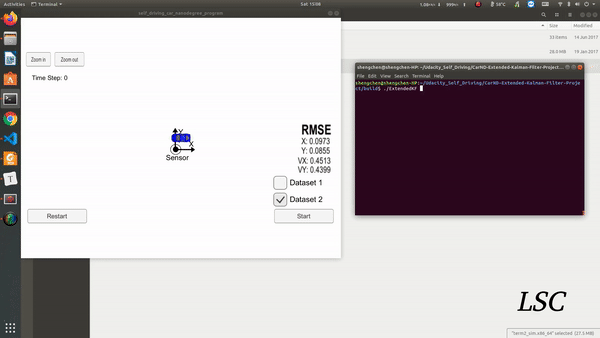
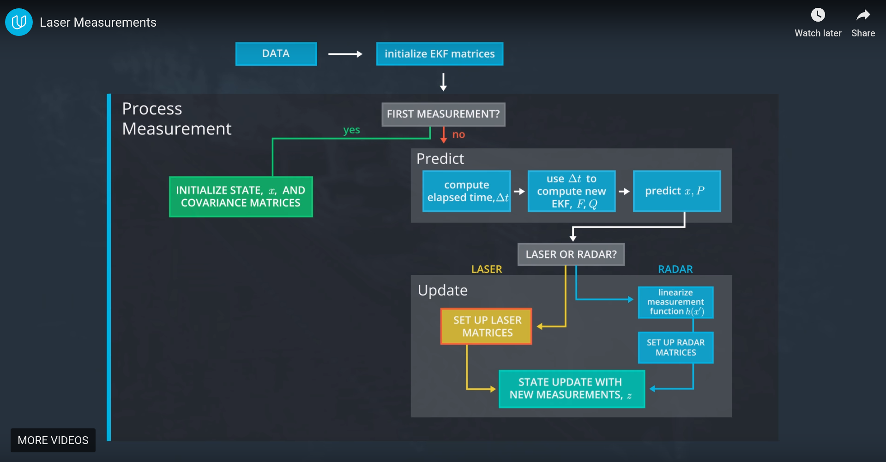

# Extended Kalman Filter Project 
## Self-Driving Car Engineer Nanodegree Program-Extended Kalman Filter Project 

To view the video on Youtube, click on the following image:

Dataset 1:

[](https://youtu.be/rt-RpNMnipY)


Dataset 2:

[](https://youtu.be/zMffPD7hg5M)

## Project Introduction

We are providing simulated lidar and radar measurements detecting a  bicycle that travels around your vehicle. You will use a Kalman filter,  lidar measurements and radar measurements to track the bicycle's  position and velocity.

In this project you will utilize a kalman filter to estimate the state of a moving object of interest with noisy lidar and radar measurements. Passing the project requires obtaining RMSE values that are lower than the tolerance outlined in the project rubric. 

The Kalman Filter algorithm will go through the following steps:

- **first measurement** - the filter will receive initial measurements of the bicycle's position relative to the car. These  measurements will come from a radar or lidar sensor.
- **initialize state and covariance matrices** - the filter will initialize the bicycle's position based on the first measurement.
- then the car will receive another sensor measurement after a time period Δt\Delta{t}Δt.
- **predict** - the algorithm will predict where the bicycle will be after time Δt\Delta{t}Δt. One basic way to predict the bicycle location after Δt\Delta{t}Δt is to assume the bicycle's velocity is constant; thus the bicycle will have moved velocity * Δt\Delta{t}Δt. In the extended Kalman filter lesson, we will assume the velocity is constant.
- **update** - the  filter compares the "predicted"  location with what the sensor measurement says. The predicted location  and the measured location are combined to give an updated location. The  Kalman filter will put more weight on either the predicted location or  the measured location depending on the uncertainty of each value.
- then the car will receive another sensor measurement after a time period Δt\Delta{t}Δt. The algorithm then does another **predict** and **update** step.



This project involves the Term 2 Simulator which can be downloaded [here](https://github.com/udacity/self-driving-car-sim/releases).

This repository includes two files that can be used to set up and install [uWebSocketIO](https://github.com/uWebSockets/uWebSockets) for either Linux or Mac systems. For windows you can use either Docker, VMware, or even [Windows 10 Bash on Ubuntu](https://www.howtogeek.com/249966/how-to-install-and-use-the-linux-bash-shell-on-windows-10/) to install uWebSocketIO. Please see the uWebSocketIO Starter Guide page in the classroom within the EKF Project lesson for the required version and installation scripts.

Once the install for uWebSocketIO is complete, the main program can be built and run by doing the following from the project top directory.

1. mkdir build
2. cd build
3. cmake ..
4. make
5. ./ExtendedKF

Tips for setting up your environment can be found in the classroom lesson for this project.

Note that the programs that need to be written to accomplish the project are src/FusionEKF.cpp, src/FusionEKF.h, kalman_filter.cpp, kalman_filter.h, tools.cpp, and tools.h

The program main.cpp has already been filled out, but feel free to modify it.

Here is the main protocol that main.cpp uses for uWebSocketIO in communicating with the simulator.


**INPUT**: values provided by the simulator to the c++ program

["sensor_measurement"] => the measurement that the simulator observed (either lidar or radar)


**OUTPUT**: values provided by the c++ program to the simulator

["estimate_x"] <= kalman filter estimated position x

["estimate_y"] <= kalman filter estimated position y

["rmse_x"]

["rmse_y"]

["rmse_vx"]

["rmse_vy"]

---

## Other Important Dependencies

* cmake >= 3.5
  * All OSes: [click here for installation instructions](https://cmake.org/install/)
* make >= 4.1 (Linux, Mac), 3.81 (Windows)
  * Linux: make is installed by default on most Linux distros
  * Mac: [install Xcode command line tools to get make](https://developer.apple.com/xcode/features/)
  * Windows: [Click here for installation instructions](http://gnuwin32.sourceforge.net/packages/make.htm)
* gcc/g++ >= 5.4
  * Linux: gcc / g++ is installed by default on most Linux distros
  * Mac: same deal as make - [install Xcode command line tools](https://developer.apple.com/xcode/features/)
  * Windows: recommend using [MinGW](http://www.mingw.org/)

## Basic Build Instructions

1. Clone this repo.
2. Make a build directory: `mkdir build && cd build`
3. Compile: `cmake .. && make` 
4. Run it: `./ExtendedKF `

## Editor Settings

We've purposefully kept editor configuration files out of this repo in order to
keep it as simple and environment agnostic as possible. However, we recommend
using the following settings:

* indent using spaces
* set tab width to 2 spaces (keeps the matrices in source code aligned)

## Code Style

Please (do your best to) stick to [Google's C++ style guide](https://google.github.io/styleguide/cppguide.html).

## Generating Additional Data

This is optional!

If you'd like to generate your own radar and lidar data, see the
[utilities repo](https://github.com/udacity/CarND-Mercedes-SF-Utilities) for
Matlab scripts that can generate additional data.

## [Rubric](https://review.udacity.com/#!/rubrics/748/view) points

### Compiling

#### Your code should compile

The code compiles without errors. I did change the [CMackeLists.txt](./CMakeLists.txt) to add the creation of the `./Tests`. I don't think this will create incompatibilities with other platforms, but I only test it on Mac OS.

### Accuracy

#### px, py, vx, vy output coordinates must have an RMSE <= [.11, .11, 0.52, 0.52] when using the file: "obj_pose-laser-radar-synthetic-input.txt which is the same data file the simulator uses for Dataset 1"

The EKF accuracy was:

- Dataset 1 : RMSE <= [0.0973, 0.0855, 0.4513, 0.4399]

### Following the Correct Algorithm

#### Your Sensor Fusion algorithm follows the general processing flow as taught in the preceding lessons.

The Kalman filter implementation can be found [src/kalman_filter.cpp](./src/kalman_filter.cpp) and it is used to predict at [src/FusionEKF.cpp](./src/kalman_filter.cpp#L147) line 147 and to update line 159 to 169.

### Your Kalman Filter algorithm handles the first measurements appropriately.

The first measurement is handled at [src/FusionEKF.cpp](./src/kalman_filter.cpp#L61) from line 61 to line 107.

### Your Kalman Filter algorithm first predicts then updates.

The predict operation could be found at [src/FusionEKF.cpp](./src/kalman_filter.cpp#L147) line 147 and the update operation from line 159 to 169 of the same file.

### Your Kalman Filter can handle radar and lidar measurements.

Different type of measurements are handled in two places in [src/FusionEKF.cpp](./src/kalman_filter.cpp):

- For the first measurement from line 61 to line 107.
- For the update part from line 159 to 169.

### Code Efficiency

#### Your algorithm should avoid unnecessary calculations.

An example of this calculation optimization is when the Q matrix is calculated [src/FusionEKF.cpp](./src/kalman_filter.cpp#L141) line 135 to line 144.

## Hints and Tips!

* You don't have to follow this directory structure, but if you do, your work
  will span all of the .cpp files here. Keep an eye out for TODOs.
* Students have reported rapid expansion of log files when using the term 2 simulator.  This appears to be associated with not being connected to uWebSockets.  If this does occur,  please make sure you are conneted to uWebSockets. The following workaround may also be effective at preventing large log files.

    + create an empty log file
    + remove write permissions so that the simulator can't write to log
 * Please note that the ```Eigen``` library does not initialize ```VectorXd``` or ```MatrixXd``` objects with zeros upon creation.


